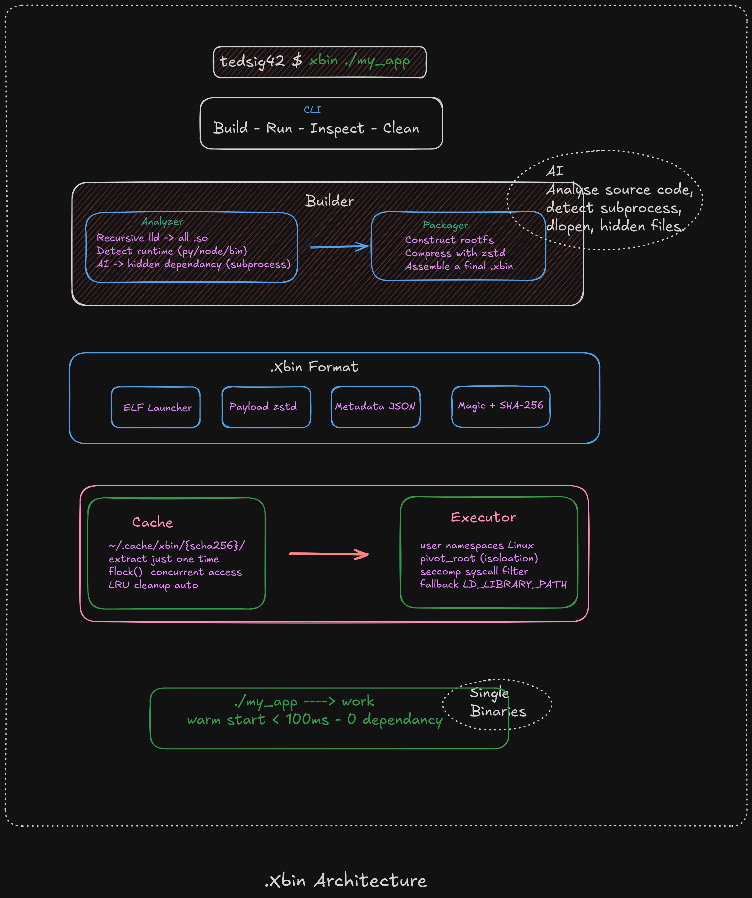

<div align="center">

# x.bin

**Ship your web app like a binary. Run anywhere.**

<sub>`x` = n'importe quelle app · `.bin` = un binaire. La commande s'appelle `xbin`, les fichiers sont des `.xbin`.</sub>

Transforme n'importe quelle app web / serveur / outil headless en **un seul
fichier exécutable autonome**. Zéro runtime à installer. Zéro Docker.

```bash
chmod +x mon_app.xbin && ./mon_app.xbin
# Server listening on http://127.0.0.1:8080
```

</div>

---

## C'est quoi ?

Distribuer une app serveur casse toujours sur la machine d'en face : mauvaise
version de Node/Python, lib `.so` manquante, chemins différents — le bon vieux
*« ça marche chez moi »*. Docker règle ça mais demande un daemon root et toute
une cérémonie d'images/registries/volumes.

`xbin` prend l'angle opposé : il empaquette ton app **et tout ce dont elle a
besoin** (runtime, libs, code) dans un seul ELF auto-extractible. L'utilisateur
le rend exécutable, le lance, et le serveur démarre. C'est tout.

### Le positionnement (important)

- **Ce n'est pas un concurrent d'AppImage / Snap / Flatpak** — ceux-là visent les
  apps **desktop GUI** (X11, intégration bureau). `xbin` vise les apps
  **web/serveur/CLI headless** : tu lances le binaire, le serveur tourne, tu
  ouvres ton navigateur.
- **Ce n'est pas `pkg` / `nexe` / PyInstaller** — eux sont mono-langage. `xbin`
  empaquette un *rootfs*, donc il est **language-agnostic** (Python, Node, Go,
  binaire natif).
- Pitch en une phrase : *« pour les cas où Docker est trop lourd et où AppImage
  ne s'applique pas. »*

## Démo (ça tourne vraiment)

```bash
make stub        # compile le launcher Rust statique (musl)
make example     # build examples/hello-web → ./hello-web.xbin (7.1 MB)
./hello-web.xbin # démarre un serveur HTTP, zéro dépendance sur la machine
```

```
$ xbin inspect hello-web.xbin
name:            hello-web
runtime:         python
entrypoint:      /usr/bin/python3.12 /app/app.py
payload:         6.4MB compressed / 26.4MB raw
payload sha256:  f342fa0d…
```

## Architecture



Quatre couches découplées, reliées par le **format `.xbin`** (le contrat partagé
entre builder et launcher) :

```
CLI (xbin)            build · run · inspect · clean
   │
Builder              Analyzer (ldd + runtime + IA) · Packager (rootfs + zstd)
   │
Format .xbin         [ ELF launcher ][ payload zstd ][ metadata JSON ][ footer ]
   │
Runtime (launcher)   self-read /proc/self/exe · cache atomique · executor
```

**Comment ça marche, étape par étape :**

1. `xbin build` détecte le runtime, résout les `.so` via `ldd`, assemble un mini
   rootfs, le compresse (zstd) et le colle après un launcher Rust statique.
2. À l'exécution, le launcher se lit lui-même via `/proc/self/exe`, lit le
   **footer** en fin de fichier (le magic ELF doit rester à l'offset 0, donc nos
   métadonnées vont à la fin), vérifie l'intégrité SHA-256.
3. Il extrait le rootfs **une seule fois** dans `~/.cache/xbin/{sha256}/`
   (extraction atomique via `rename()`), puis `execve` l'app.
4. Les lancements suivants sautent l'extraction (warm start).

> Le diagramme ci-dessus décrit l'**architecture cible** (fin de Phase 2/3) — il
> inclut user namespaces, seccomp et signature. Le MVP actuel implémente le
> pipeline complet en isolation **niveau 0** (`LD_LIBRARY_PATH`). Le détail de
> l'écart cible/MVP est dans la doc.

## Structure du repo

```
xbin/
├── stub/                  Launcher Rust (compilé statique musl)
│   └── src/
│       ├── main.rs        flux : self-read → vérif → cache → exec
│       └── format.rs      lecture du footer .xbin
├── cli/                   Builder + CLI Python (stdlib only)
│   └── xbin/
│       ├── cli.py         commandes build / run / inspect
│       ├── build.py       construction rootfs + assemblage
│       ├── format.py      écriture du footer (sync avec format.rs)
│       ├── inspect.py
│       └── analyzer/
│           ├── ldd.py     détection des .so
│           └── runtime.py détection python/node/binaire + entrypoint
├── examples/hello-web/    app de démo (serveur HTTP stdlib)
├── docs/                  documentation mdbook
└── Makefile
```

## Documentation

Doc complète (concepts, référence, guides, roadmap, sécurité) avec mdbook :

```bash
make docs          # construit le book dans docs/book/
make docs-serve    # sert sur http://localhost:3000 avec live-reload
```

## Commandes CLI

```bash
xbin build ./mon_app -o mon_app.xbin   # analyse + produit le .xbin
xbin run   mon_app.xbin                # lance (= ./mon_app.xbin)
xbin inspect mon_app.xbin              # affiche le contenu sans extraire
```

Debug : `XBIN_VERBOSE=1 ./mon_app.xbin` montre cold/warm start.

## Statut & limites honnêtes

✅ Pipeline complet fonctionnel (build → run → cache → serveur HTTP).
✅ Python stdlib **et** dépendances tierces (`.venv` / `site-packages/`).
✅ Intégrité SHA-256, extraction atomique, `flock()` concurrent, `xbin clean`.
✅ **Format v2 en couches + rebuild incrémental** : runtime réutilisé depuis le
   cache de build → rebuild ~25 s → ~1 s, cache partagé entre apps.

🔜 **Phase 2** : `requirements.txt` auto (pip au build), Node de bout en bout,
signature Ed25519, isolation niveau 2 (user namespaces → portabilité
inter-distribution réelle), analyzer IA (deps cachées : `subprocess`, `dlopen`).

🔜 **Phase 3** : squashfs+mmap (cold start < 100 ms), réutilisation d'extraction
par couche (overlayfs), multi-arch.

Voir [`docs/src/roadmap.md`](docs/src/roadmap.md) pour le détail.
# x.bin
